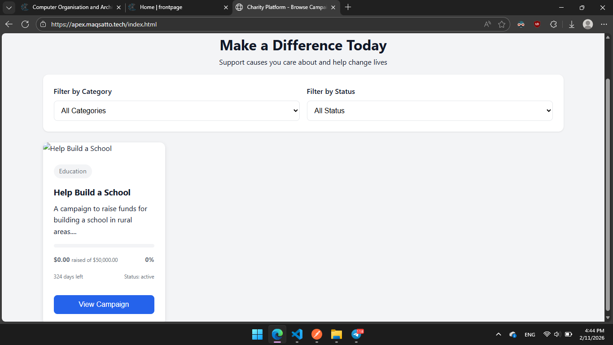
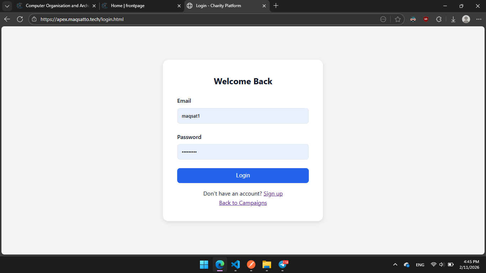
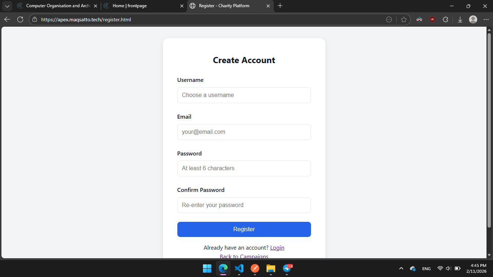
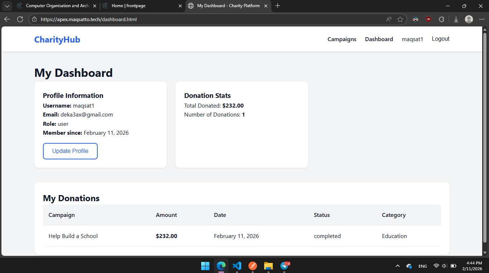

# Charity/Donation Platform

Full-stack web app for managing charity campaigns and donations.

**Live:** https://apex.maqsatto.tech

**Team Apex** — Maqsat, Bekzat, Nazarbek, Raibek

---

## Tech Stack

- **Backend:** Node.js, Express, MongoDB/Mongoose, JWT, Joi, Resend (email)
- **Frontend:** HTML/CSS/JS, Fetch API

## Project Structure

```
src/
  controllers/    — auth, campaign, donation, user logic
  models/         — User, Campaign, Donation schemas
  routes/         — API route definitions
  middleware/     — auth, roles, validation, error handling
  config/         — DB connection, email setup
  app.js          — Express app

frontend/
  index.html      — campaign listing
  login.html      — login page
  register.html   — registration
  dashboard.html  — user dashboard
  admin.html      — admin/moderator panel
  campaign-details.html
  css/style.css
  js/             — api, auth, campaigns, donations, guard

server.js         — entry point
docker-compose.yml
Dockerfile
nginx/            — reverse proxy config
openapi.yaml      — API spec
```

## Running Locally

```bash
npm install
cp .env.example .env   # edit with your values
npm run dev             # starts on http://localhost:5000
```

Needs MongoDB running locally or a connection string in `.env`.

## Environment Variables

| Variable         | Description                   |
| ---------------- | ----------------------------- |
| `PORT`           | Server port (default 5000)    |
| `NODE_ENV`       | `development` or `production` |
| `MONGODB_URI`    | MongoDB connection string     |
| `JWT_SECRET`     | Secret for signing tokens     |
| `JWT_EXPIRE`     | Token expiry (e.g. `7d`)      |
| `EMAIL_HOST`     | SMTP host                     |
| `EMAIL_PORT`     | SMTP port                     |
| `EMAIL_USER`     | SMTP user                     |
| `EMAIL_PASSWORD` | SMTP password / API key       |
| `EMAIL_FROM`     | Sender email address          |
| `FRONTEND_URL`   | For CORS                      |

## API Endpoints

Base URL: `https://apex.maqsatto.tech/api`

Full spec: [openapi.yaml](openapi.yaml)

### Auth (public)

| Method | Endpoint             | Description        |
| ------ | -------------------- | ------------------ |
| POST   | `/api/auth/register` | Register           |
| POST   | `/api/auth/login`    | Login, returns JWT |

### Campaigns

| Method | Endpoint             | Auth      | Description                               |
| ------ | -------------------- | --------- | ----------------------------------------- |
| GET    | `/api/campaigns`     | —         | List all (filter by `status`, `category`) |
| GET    | `/api/campaigns/:id` | —         | Single campaign                           |
| POST   | `/api/campaigns`     | admin/mod | Create                                    |
| PUT    | `/api/campaigns/:id` | admin/mod | Update                                    |
| DELETE | `/api/campaigns/:id` | admin     | Delete                                    |

### Donations

| Method | Endpoint                      | Auth  | Description                 |
| ------ | ----------------------------- | ----- | --------------------------- |
| GET    | `/api/donations/campaign/:id` | —     | Campaign donations (public) |
| POST   | `/api/donations`              | user  | Create donation             |
| GET    | `/api/donations`              | user  | My donations                |
| GET    | `/api/donations/:id`          | user  | Single donation             |
| DELETE | `/api/donations/:id`          | admin | Delete                      |

### Users

| Method | Endpoint             | Auth | Description    |
| ------ | -------------------- | ---- | -------------- |
| GET    | `/api/users/profile` | user | Get profile    |
| PUT    | `/api/users/profile` | user | Update profile |

### Health

```
GET /api/health → { "success": true, "message": "API is running" }
```

All protected endpoints require `Authorization: Bearer <token>` header.

## Roles

- **user** — browse, donate, manage own profile
- **moderator** — + create/edit campaigns
- **admin** — + delete campaigns/donations

## Screenshots

### Campaign Listing



### Login



### Registration



### Dashboard



### Admin Panel


## Docker Deployment

The app runs on the server with Docker Compose (Node app + MongoDB + Nginx + Certbot for SSL).

```bash
docker compose up -d --build
```

See `docker-compose.yml` and `nginx/default.conf` for config.

## Team

| Member   | Role                        |
| -------- | --------------------------- |
| Maqsat   | Team Lead, DevOps & Backend |
| Bekzat   | Backend Developer           |
| Nazarbek | Frontend Developer          |
| Raibek   | Frontend Developer          |

**Contact:** admin@maqsatto.tech

**License:** MIT
